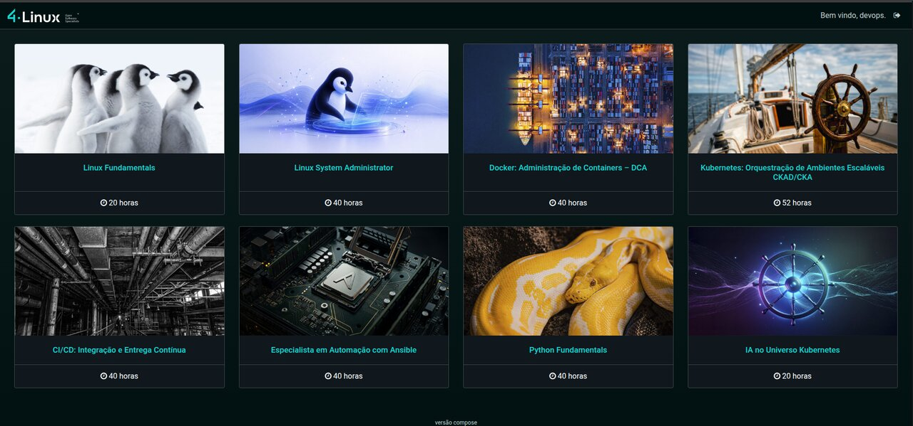

# Course Catalog

Aplicação de exemplo dos cursos de CI/CD da 4Linux: um pequeno catálogo de cursos escrito em Python 3 e Flask, com banco de dados MariaDB.



Ela existe para ser levada por um pipeline, e por isso possui:

- Testes unitários (pytest)
- Testes funcionais (Selenium)
- Imagem de container
- Endpoints de saúde para o Kubernetes

## Rotas

|Rota|Descrição|
|---|---|
|`/`|Login|
|`/register`|Cadastro de usuário|
|`/courses`|Lista de cursos (exige login)|
|`/logout`|Encerra a sessão|
|`/health`|A aplicação está no ar. Não consulta o banco|
|`/ready`|A aplicação consegue atender, ou seja, o banco responde|

## Configuração

Toda a configuração é feita por variáveis de ambiente:

|Variável|Padrão|Descrição|
|---|---|---|
|`DB_HOST`|`mariadb`|Endereço do banco de dados|
|`DB_PORT`|`3306`|Porta do banco de dados|
|`DB_USER`|`root`|Usuário do banco de dados|
|`DB_PASSWORD`|`qwe123qwe`|Senha do banco de dados|
|`DB_NAME`|`simplePythonFlask`|Nome do banco de dados|
|`DATABASE_URL`||URL completa do SQLAlchemy. Quando definida, substitui as variáveis `DB_*`|
|`SECRET_KEY`|valor de desenvolvimento|Chave de assinatura da sessão|
|`APP_VERSION`|`dev`|Versão exibida no rodapé e em `/health`|

## Executando localmente

É necessário somente Docker com o plugin Compose.

### 1. Subir a aplicação

```sh
docker compose up -d --build
```

São criados três containers: o banco **mariadb**, o **web_initiate_db**, que cria o banco, as tabelas e a carga inicial de cursos e em seguida termina, e o **web** com a aplicação.

### 2. Validar

```sh
docker compose ps
curl localhost:5000/health
curl localhost:5000/ready
```

O `/health` deve responder `{"status":"ok","version":"compose"}` e o `/ready` `{"database":"up","status":"ok"}`.

### 3. Acessar

Abra http://localhost:5000, clique em **here** para se registrar (usuário com no mínimo 6 caracteres) e em seguida faça o login. A lista de cursos deve ser apresentada.

### 4. Testes unitários

```sh
docker build --target test -t course_catalog:test .
docker run --rm course_catalog:test
```

Para obter os relatórios (`junit.xml` e `coverage.xml`) fora do container:

```sh
docker run --name unit course_catalog:test
docker cp unit:/courseCatalog/reports .
docker rm unit
```

### 5. Testes funcionais

Com a aplicação no ar (passo 1):

```sh
docker compose --profile test up -d selenium
docker compose --profile test run --rm functional
```

O navegador controlado pelo Selenium pode ser acompanhado em http://localhost:7900 (senha `secret`).

Para testar uma aplicação em outro endereço, por exemplo um ambiente de homologação:

```sh
docker run --rm \
  -e APP_URL=http://<ENDERECO_DA_APLICACAO> \
  -e SELENIUM_URL=http://<ENDERECO_DO_SELENIUM>:4444/wd/hub \
  course_catalog:test python3 tests/functional/test_functional.py
```

### 6. Encerrar

```sh
docker compose --profile test down       # mantém os dados do banco
docker compose --profile test down -v    # remove também os dados
```

## Imagem

O `Dockerfile` possui dois alvos:

|Alvo|Conteúdo|Uso|
|---|---|---|
|`runtime` (padrão)|Aplicação e dependências de execução, rodando com gunicorn e usuário sem privilégios|Imagem enviada ao registry|
|`test`|O mesmo código, mais pytest, Selenium e os testes|Etapas de teste do pipeline|

```sh
docker build -t course_catalog:0.1 --build-arg APP_VERSION=0.1 .
```

## Estrutura

```
.
├── app.py                  # ponto de entrada (gunicorn app:app)
├── create_db.py            # cria banco, tabelas e carga inicial
├── project/                # aplicação Flask
│   ├── courses/            # lista de cursos
│   ├── health/             # /health e /ready
│   ├── users/              # login e cadastro
│   ├── static/ templates/
│   ├── _config.py          # configuração por variáveis de ambiente
│   └── models.py
├── tests/
│   ├── unit/
│   └── functional/
├── Dockerfile
└── docker-compose.yml
```

## Deploy

Os manifests Kubernetes desta aplicação ficam em um repositório separado, o [course-catalog-deploy](https://github.com/4linux/course-catalog-deploy), no modelo GitOps. Este repositório contém somente o código, os testes e a imagem.

## Problemas intencionais

O código mantém, de propósito, alguns problemas de qualidade para serem encontrados pelas ferramentas de análise durante o curso. Eles estão listados em [docs/problemas-intencionais.md](docs/problemas-intencionais.md). **Não os corrija** sem alinhar com o material do curso.
